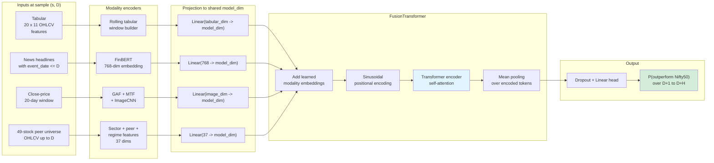

# Nifty50 Multimodal Transformer

A multimodal Transformer for short-horizon Nifty50 outperformance prediction. The project combines four views of the same stock/date sample: tabular OHLCV features, real financial news encoded with FinBERT, GAF/MTF time-series images encoded with a CNN, and relational sector/peer knowledge-graph features. The pipeline is leakage-safe, uses purged walk-forward cross-validation, and evaluates whether each modality contributes signal beyond a tabular baseline. The cleanest current result comes from Run C: a 6-stock training subset with 37-feature KG context computed against a 49-stock Nifty50 peer universe.

This is an educational/coursework project, not financial advice or a trading system.

---

## Headline results

All headline numbers below are from Run C, run ID `20260510_102537`: 6 training stocks, 49-stock Nifty50 peer universe, 1,260 samples, 45.1% positive label rate, 20-day windows, 3-day horizon, 3-fold purged walk-forward CV, embargo=3 days, 20 epochs, batch size 16, seed 42, GPU.

### Modality contributions

| Variant | ROC-AUC mean ± std | Δ vs `tabular_only` |
|---|---:|---:|
| `tabular_only` | 0.478 ± 0.072 | — |
| `tabular_kg` — 37 relational KG features | 0.491 ± 0.070 | +0.014 |
| `tabular_image` — GAF/MTF + CNN | 0.518 ± 0.048 | +0.041 |
| `tabular_text` — FinBERT real news | 0.519 ± 0.092 | +0.041 |
| `tabular_image_text_kg` — all four modalities | 0.496 ± 0.094 | +0.019 |

### Corrected backtest

Run C backtest uses real 3-day forward returns, top-K=3 selection, daily rebalancing, and 155 rebalance dates across 157 trading days.

| Metric | Model | Benchmark |
|---|---:|---:|
| Total return | +5.9% | −4.6% |
| Sharpe, rf=0 | 0.94 | n/a |
| Max drawdown | −20.2% | — |
| Average position count | 2.96 | — |

The absolute AUC is modest because the experiment is small: 1,260 samples, 6 training stocks, and 1 year of market history. The ordering of the ablation deltas is the useful result: text and image each add about +0.041 ROC-AUC over the tabular baseline, KG adds a smaller +0.014, and the all-modality model currently underperforms the best single auxiliary modality. The backtest is also deliberately modest: +5.9% model return versus −4.6% benchmark return after correcting earlier return-proxy and overlapping-position bugs.

---

## Methodology

### Leakage safety

Every sample is keyed by `(stock_id, end_date)`. Tabular windows contain only rows with `date <= end_date`; text records are filtered to `event_date <= end_date`; GAF/MTF images are generated from price windows ending at `end_date`; KG features are computed as of `end_date`; and labels use future returns from `end_date + 1` through `end_date + horizon`. The KG modality also enforces leakage safety over the peer universe: peer correlations, sector statistics, and market-regime features for sample `(s, D)` use only data with `date <= D`. These invariants are tested in [`tests/integration/test_no_leakage.py`](tests/integration/test_no_leakage.py).

### Cross-validation

Evaluation uses purged walk-forward cross-validation with an expanding training window. Purging removes training samples whose label window overlaps the validation fold; the Run C setting uses 3 folds with a 3-day embargo. The implementation is in [`src/training/cv.py`](src/training/cv.py). With only 1,260 samples and one random seed, fold-level variance remains meaningful, so the results should be read as evidence of signal ordering rather than precise estimates of each modality's true contribution.

### Modality independence

The project measures distance correlation between mean-pooled modality embeddings to check whether auxiliary modalities contain information not already present in tabular features. Run C independence values are: `(tabular, text)=0.143`, `(tabular, image)=0.131`, `(tabular, kg)=0.166`, `(text, kg)=0.173`, versus a shuffled baseline of `0.041`. The KG-tabular independence rose from `0.130` with the earlier 4-feature / small-peer configuration to `0.166` with the 37-feature KG and 49-stock peer universe.

### Peer universe versus training universe

The training universe is intentionally small: 6 stocks where price, news, and image data can be processed reliably in a coursework-scale Colab run. The KG peer universe is much larger: 49 current Nifty50 tickers, excluding TMPV because of post-demerger ticker uncertainty. This decoupling lets the model train on a manageable rich-data subset while computing sector, peer-correlation, rank, dispersion, and regime features against a representative market universe.

---

## Methodology robustness — what the iteration showed

The KG modality went through three measured configurations. The first compact KG had 4 features — sector identifier, peer return, recent return, and event flags — computed against the same 6-stock training universe. Its contribution was effectively zero: `−0.003` in the initial run and `+0.001` after the trainer fix. Replacing it with a 37-feature relational vector — sector context, peer correlations, relative ranks, dispersion, spreads, and regime indicators — improved the ablation delta to `+0.045`, but that result still used a 6-stock peer universe.

Run C repeated the experiment with the same 6-stock training universe but computed KG features against a 49-stock Nifty50 peer universe. The KG delta dropped from `+0.045` to `+0.014`. That correction is important. It means the earlier `+0.045` was partly an artifact of the too-small peer universe: random-looking peer features over a small set can appear predictive in a small validation sample. The conservative Run C interpretation is that KG carries real but small incremental information: its independence from tabular features is `0.166` versus a shuffled baseline of `0.041`, but the predictive delta is only `+0.014` ROC-AUC at this scale.

The backtest underwent a similar correction. An early implementation used the binary label as a return proxy and reported apparent total returns around `+204%` with Sharpe `6.45`, which was implausible for a model whose ROC-AUC was near 0.5. The corrected backtest uses real forward returns, aggregates concurrent holdings under daily rebalancing, and deduplicates predictions across folds. Under that corrected path, Run C produces `+5.9%` model return versus `−4.6%` benchmark return, Sharpe `0.94`, and max drawdown `−20.2%`. These corrections are explicit because the methodology is only credible if the headline numbers survive robustness checks.

---

## What's in this repo

The central artifact aligns all modalities by `(stock_id, end_date)`:

```text
(stock_id, end_date)
  -> tabular_tokens
  -> text_tokens
  -> image_tokens
  -> kg_tokens
  -> y
```

Current modality encodings:

- **Tabular**: 11 OHLCV-derived and benchmark-relative features over a 20-day rolling window.
- **Text**: real `yfinance` news before the prediction date, encoded by FinBERT into a 768-dimensional text embedding.
- **Image**: GAF + MTF representations of the close-price window, encoded by a CNN.
- **KG**: 37 leakage-safe relational features: sector context, peer correlations, relative ranks, dispersion, spreads, and market-regime indicators, computed against the 49-stock peer universe.

The fusion model projects each enabled modality to `model_dim`, adds learned modality embeddings and sinusoidal positional encoding, mixes tokens with encoder-only Transformer self-attention, mean-pools the encoded tokens, and emits a binary outperformance logit through a linear head. The implementation supports CLS pooling, but the current default and recommended setting is mean pooling because it fixed the earlier shallow-encoder collapse.

---

## Architecture diagram



---

## Limitations and what's open

**Scale.** Run C trains on 6 stocks over 1 year, producing 1,260 samples. The 49-stock peer universe improves KG feature quality, but the supervised training set is still small. These numbers should be replicated on a larger training universe and longer history before making stronger claims.

**Combining modalities currently hurts.** The all-four variant improves over tabular-only by `+0.019`, but underperforms text-alone and image-alone, each at `+0.041`. This is a genuine finding: at this dataset size, adding modalities appears to introduce noise faster than the compact fusion model can resolve it. Possible fixes include more data, deeper fusion, modality dropout, learned modality weighting, or regime-aware heads.

**Single-seed evaluation.** Run C uses seed `42`. Multi-seed evaluation would put confidence intervals around individual modality deltas. The current writeup treats the ordering of modality contributions as the main finding rather than the exact magnitude of each number.

---

## Reproducing the results

To run on Google Colab instead of locally, open [`notebooks/colab/run_experiment.ipynb`](notebooks/colab/run_experiment.ipynb), set the training tickers, peer tickers, period, and output path in the config cell, and run unattended. Results write to Google Drive.

Local setup:

```bash
python -m venv .venv
.venv\Scripts\activate          # Windows: .venv\Scripts\activate
pip install -r requirements.txt
pip install -e .
```

Run tests:

```bash
pytest
```

Build a quick real-world artifact and smoke ablation:

```bash
python scripts/run_real_world_demo.py \
  --output-dir data/processed/real_world_demo \
  --period 1y \
  --window-size 20 \
  --horizon-days 3 \
  --run-ablations \
  --epochs 1 \
  --batch-size 4 \
  --device cpu
```

Run a longer ablation from an existing artifact:

```bash
python scripts/run_ablation_study.py \
  --dataset data/processed/real_world_demo/real_world_multimodal_samples_gaf.npz \
  --output-dir data/processed/real_world_demo/ablations \
  --cv-splits 3 \
  --horizon-days 3 \
  --embargo-days 3 \
  --epochs 20 \
  --batch-size 16 \
  --device cuda \
  --model-dim 16 \
  --num-heads 4 \
  --num-layers 1 \
  --ff-dim 32
```

Run the corrected backtest:

```bash
python scripts/run_backtest.py \
  --predictions data/processed/real_world_demo/ablations/prediction_scores_tabular_image_text_kg.csv \
  --tabular-samples data/processed/real_world_demo/tabular_samples.csv \
  --output-dir data/processed/real_world_demo/backtest \
  --top-k 3
```

---

## Project structure

```text
.
├── AGENTS.md                     # contributor workflow instructions
├── config/                       # ticker and sector configuration
├── docs/
│   ├── architecture.md           # implementation-level architecture
│   ├── findings.md               # experimental details and robustness notes
│   ├── design-notes.md           # rationale for non-obvious design choices
│   └── figures/                  # curated visual outputs
├── notebooks/
│   └── colab/run_experiment.ipynb # long-running Colab experiment runner
├── scripts/                      # demo, ablations, backtest, diagnostics
├── src/                          # data, KG, models, training, viz modules
└── tests/                        # unit and integration tests
```

---

## Responsible use

This is a coursework project. It is not financial advice, not a trading system, and not a validated investment model. The primary contribution is the methodology: leakage-safe multimodal sample construction, purged walk-forward evaluation, modality-independence measurement, and honest correction of results that did not survive robustness checks.
