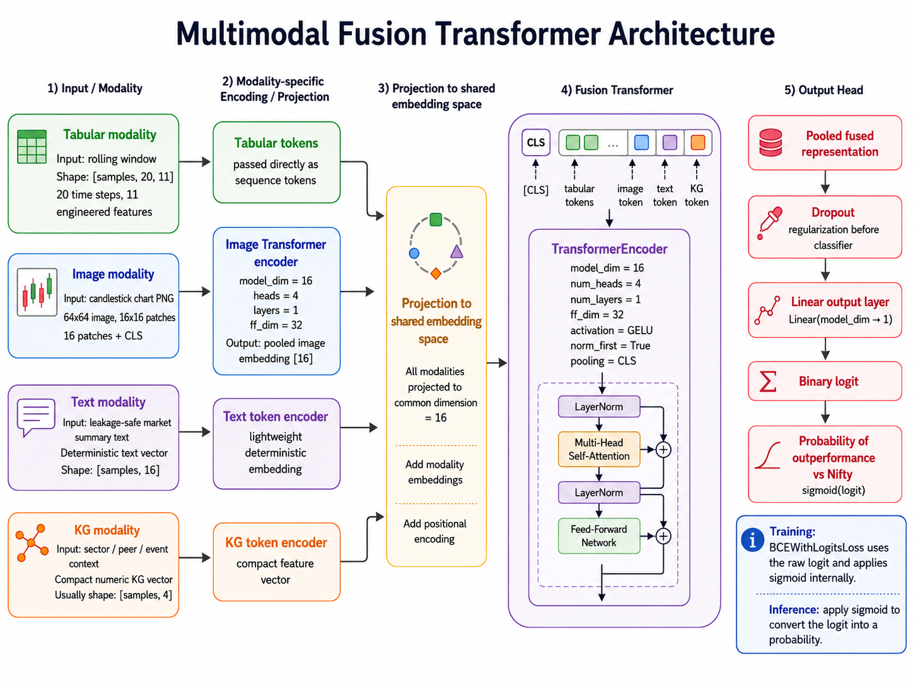

# Nifty50 Multimodal Transformer Architecture

## 1. Purpose and scope

This document describes the architecture of the Nifty50 Multimodal Transformer demo system.

The system is designed to answer one supervised prediction question:

> Given market, chart, text, and graph-context signals available for a stock at a prediction date, estimate whether that stock will outperform the Nifty50 benchmark over a short future horizon.

The current implementation is an educational, coursework-scale architecture. It demonstrates the end-to-end representation pipeline:

```text
raw multimodal data
  -> aligned sample construction
  -> modality-specific token creation
  -> shared embedding projection
  -> encoder-only multimodal fusion Transformer
  -> binary outperformance logit
```

It is not a production trading system, and it does not yet implement a full portfolio backtest.

---

## 2. Transformer Architecture
The model is encoder-only. We are not generating text or sequences, so we do not need a Transformer decoder. We create supervised training samples where each row contains aligned tabular, image, text, and KG tokens plus a label saying whether the stock outperformed Nifty over the future horizon. Self-attention helps the model mix signals across tokens and modalities, but the learning signal comes from comparing the predicted logit with the actual label using binary cross-entropy loss. During training, `BCEWithLogitsLoss` consumes the raw logit and applies sigmoid internally. During inference, sigmoid converts the logit into the probability of outperformance versus the Nifty.



## 2. Architectural principles

The design follows four main principles.

### 2.1 Alignment first

Every modality must describe the same stock and the same prediction date.

The canonical alignment key is:

```text
(stock_id, end_date)
```

For one aligned sample, the artifact contains:

```text
tabular_tokens
image_tokens
text_tokens
kg_tokens
y
stock_ids
end_dates
```

This is the core design decision that turns separate modality pipelines into a true multimodal dataset.

### 2.2 No future leakage

Each modality is constructed only from information available on or before the sample date.

Examples:

```text
text event_date <= sample end_date
chart window ends at sample end_date
KG events are retrieved as-of sample end_date
tabular window uses historical rows up to sample end_date
```

The label may look forward because it is the supervised training target, but the inputs must not.

### 2.3 Encoder-only fusion

The model uses an encoder-style Transformer rather than an encoder-decoder Transformer.

This is appropriate because the task is classification/prediction, not sequence generation. The model produces one binary prediction logit for each sample. It does not generate text or decode an output sequence.

### 2.4 Evidence through ablations

The architecture supports modality ablations so that the project can compare:

```text
tabular_only
tabular_kg
tabular_image
tabular_text
tabular_image_text_kg
```

Ablations are used to validate the contribution and behavior of modalities. They should not be interpreted as a full investment backtest.

---

## 3. Data and sample construction

### 3.1 Raw data sources

The real-world demo uses a compact default universe:

```text
Stocks:
- RELIANCE.NS
- TCS.NS
- INFY.NS

Benchmark:
- ^NSEI
```

The raw market data source is yfinance OHLCV data.

The demo constructs four input views:

| Modality | Raw/derived input | Purpose |
|---|---|---|
| Tabular | OHLCV-derived features | numerical price, return, volatility, volume, benchmark-relative behavior |
| Image | generated candlestick chart PNGs | visual price structure for the same window |
| Text | leakage-safe market-summary records | textual context available by sample date |
| Knowledge graph | stock, sector, peer, recent-return, event context | relational and event context |

### 3.2 Label definition

For each stock/date sample, the supervised label is based on future benchmark-relative performance:

```text
y = 1 if future_stock_return_horizon > future_nifty_return_horizon
 y = 0 otherwise
```

In the current demo, the horizon is typically three trading days.

The label is used only as the training target. It is not included in the input feature tensors.

---

## 4. Modality encoders and embedding dimensions

The compact Colab demo uses deliberately small dimensions so that the pipeline can run in a lightweight environment.

### 4.1 Demo-level configuration

| Component | Demo value | Meaning |
|---|---:|---|
| Rolling window | `20` | each tabular sample uses 20 historical rows |
| Tabular feature count | `11` | engineered OHLCV / benchmark-relative features |
| Text embedding dimension | `16` | deterministic lightweight text vector |
| Image embedding dimension | `16` | output of the demo image Transformer encoder |
| KG embedding dimension | usually `4` | peer count, peer return, sector return, event flag; inspect NPZ for exact width |
| Shared fusion dimension | `16` | common Transformer dimension after modality projections |
| Fusion attention heads | `4` | multi-head self-attention heads |
| Fusion layers | `1` | one Transformer encoder layer in the demo run |
| Fusion feed-forward dimension | `32` | inner MLP dimension in the Transformer block |

The generated `.npz` artifact prints actual tensor shapes during the notebook run. Those printed shapes are the source of truth for a particular run.

---

## 5. Tabular modality

### 5.1 Input

The tabular modality starts from OHLCV and benchmark data.

The demo feature set is:

```text
log_return_1d
cum_return_3d
cum_return_5d
cum_return_10d
realized_vol_5d
realized_vol_10d
high_low_range_over_close
close_over_10dma_minus_1
close_over_20dma_minus_1
volume_over_20d_avg
stock_minus_index_return
```

### 5.2 Tensor shape

The demo tabular tensor shape is:

```text
tabular_tokens: [num_samples, 20, 11]
```

This means:

```text
20 time steps per sample
11 engineered features per time step
```

### 5.3 Use in fusion

Each 11-dimensional time-step vector is projected into the shared fusion dimension of 16.

The 20 projected tabular time-step tokens are included in the fused token sequence and participate in Transformer self-attention with image, text, and KG tokens.

### 5.4 Standalone tabular baseline

The repository also contains a standalone `TabularTransformer` baseline. Its default configuration is:

```text
model dimension: 64
attention heads: 4
Transformer layers: 2
feed-forward dimension: 128
pooling: mean pooling
```

The real-world fusion demo does not use that standalone baseline directly. It uses the multimodal fusion model projection path.

---

## 6. Image modality

### 6.1 Input

The image modality uses generated candlestick chart PNGs for the same stock/date sample.

Each chart is generated from a historical OHLCV window ending at the sample date.

### 6.2 Image encoder

The demo image encoder is `ImageTransformer`.

| Parameter | Demo value |
|---|---:|
| Image size | `64 x 64` |
| Patch size | `16 x 16` |
| Patch tokens | `16` patches + `1` CLS token |
| Encoder model dimension | `16` |
| Attention heads | `4` |
| Transformer encoder layers | `1` |
| Feed-forward dimension | `32` |

### 6.3 Output shape

The image encoder returns one pooled CLS embedding per chart:

```text
image_tokens: [num_samples, 16]
```

This vector is projected into the fusion model's shared 16-dimensional space.

---

## 7. Text modality

### 7.1 Input

The current real-world demo uses leakage-safe market-summary text records generated from real OHLCV-derived features.

The key cutoff rule is:

```text
text event_date <= sample end_date
```

This ensures the text path does not use future information.

### 7.2 Text encoder

The demo uses deterministic lightweight text tokenization via stable hashing. This keeps the demo CPU-friendly and avoids requiring a large pretrained language model.

### 7.3 Output shape

The text tensor shape is:

```text
text_tokens: [num_samples, 16]
```

### 7.4 Future extension

The current text encoder is intentionally simple. A future version could replace it with:

```text
FinBERT
sentence-transformer embeddings
filing/news/document encoders
```

That would make the text modality semantically stronger while preserving the same aligned artifact contract.

---

## 8. Knowledge graph modality

### 8.1 Input

The KG modality uses lightweight graph/context records:

```text
stock
sector
peer relationship
recent returns
high-volume event flags
```

### 8.2 Token fields

The compact KG token usually contains:

```text
peer_count
peer_avg_recent_return
sector_avg_recent_return
event flag(s), e.g. high_volume
```

### 8.3 Output shape

The usual demo shape is:

```text
kg_tokens: [num_samples, 4]
```

The exact width can change if event types change. Inspect the generated NPZ artifact for the exact run-specific shape.

### 8.4 Future extension

The current KG token is a compact numeric context vector. Future versions could use:

```text
learned graph embeddings
graph neural networks
richer company-sector-supply-chain relationships
```

---

## 9. Fusion Transformer

### 9.1 Fusion objective

The fusion model combines all available modality tokens into one shared representation.

The model receives modality-specific tokens, projects them into a common dimension, adds modality/positional information, and applies Transformer self-attention.

### 9.2 Demo configuration

| Parameter | Demo value |
|---|---:|
| Type | encoder-only `TransformerEncoder` |
| Decoder | not used |
| Common model dimension | `16` |
| Attention heads | `4` |
| Transformer encoder layers | `1` |
| Feed-forward dimension | `32` |
| Activation | `GELU` |
| Normalization style | `norm_first=True` |
| Pooling | `CLS` |

### 9.3 Fusion sequence

For the default all-modality demo, the conceptual fused sequence is:

```text
[CLS]
+ projected tabular tokens, shape [20, 16]
+ projected image token, shape [1, 16]
+ projected text token, shape [1, 16]
+ projected KG token, shape [1, 16]
-> TransformerEncoder self-attention
-> pooled fused representation
-> binary logit
```

The combined sequence is approximately 24 tokens including CLS.

---

## 10. Output head and nonlinearity

The output head is intentionally simple:

```text
pooled fused representation
  -> Dropout
  -> Linear(model_dim -> 1)
  -> binary logit
```

During training, the model should use the raw logit with:

```text
BCEWithLogitsLoss
```

`BCEWithLogitsLoss` applies sigmoid internally in a numerically stable way.

During inference, convert the logit into a probability with:

```text
probability = sigmoid(logit)
```

Therefore, the final nonlinearity is effectively sigmoid, but it is not manually applied before `BCEWithLogitsLoss` during training.

---

## 11. How the model learns

The model learns from supervised labelled samples. Self-attention is the mechanism that mixes information across tokens and modalities; it is not the supervision signal by itself.

One training sample is conceptually:

```text
stock_id = RELIANCE.NS
end_date = 2025-12-01

tabular_tokens = last 20 rows of engineered market features
image_tokens   = candlestick chart embedding for the same date window
text_tokens    = text/context embedding available up to that date
kg_tokens      = sector/peer/event context up to that date

y = 1 if RELIANCE.NS outperformed Nifty over the next horizon
y = 0 otherwise
```

The supervised training row is:

```text
(tabular_tokens, image_tokens, text_tokens, kg_tokens) -> y
```

The learning loop is:

```text
1. Build labelled samples
2. Pass aligned modality tokens through the model
3. Model outputs one raw score: logit
4. Compare logit with true label y
5. Compute binary cross-entropy loss
6. Backpropagate the loss
7. Update model weights
```

In code-like form:

```python
prediction_logit = model(tabular, image, text, kg)
loss = BCEWithLogitsLoss(prediction_logit, true_label)
loss.backward()
optimizer.step()
```

Self-attention helps the model decide which signals should influence each other. For example:

```text
a tabular trend token can attend to a chart token
sector context can reinforce a price/volume signal
text context can interact with benchmark-relative strength
```

But the model learns what is useful only because the predicted logit is compared with the actual future outperformance label.

Key distinction:

```text
Training samples + labels = what teaches the model
Self-attention           = how the model combines signals
Loss function            = how the model knows it was wrong
Gradient descent         = how the model updates itself
```

---

## 12. Ablation architecture

The ablation runner trains and evaluates different modality combinations against the same aligned dataset.

Default variants:

```text
tabular_only
tabular_kg
tabular_image
tabular_text
tabular_image_text_kg
```

This lets the demo compare how the model behaves when different modalities are enabled.

Ablation results are classification metrics over a compact run. They should be presented as pipeline/evaluation evidence, not as investment-grade backtest performance.

---

## 13. Current limitations

The current architecture has deliberate simplifications:

- text embeddings are deterministic lightweight vectors, not yet FinBERT or document embeddings;
- KG tokens are compact numeric context vectors, not learned graph embeddings;
- the demo model is intentionally small for Colab CPU execution;
- one-epoch ablations are not a statistically meaningful model comparison;
- a full portfolio backtest is not yet implemented;
- the model is not financial advice and should not be used as a trading system.

---

## 15. Architecture summary

```text
Raw OHLCV / charts / text / KG
  -> aligned by stock_id + end_date
  -> tabular_tokens [samples, 20, 11]
  -> image_tokens [samples, 16]
  -> text_tokens [samples, 16]
  -> kg_tokens [samples, ~4]
  -> projection to shared model_dim = 16
  -> encoder-only Fusion Transformer
       heads = 4
       layers = 1
       ff_dim = 32
       activation = GELU
       pooling = CLS
  -> Dropout
  -> Linear(16 -> 1)
  -> raw logit
  -> sigmoid(logit) at inference
```
