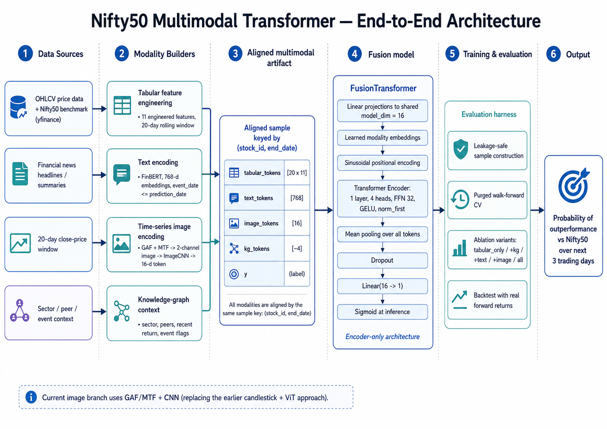
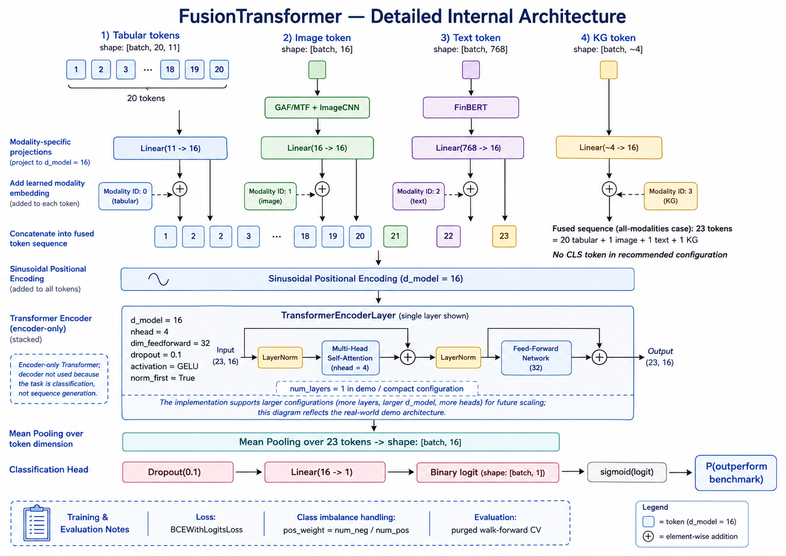

# Architecture

This document describes the current architecture of the Nifty50 Multimodal Transformer after the final pipeline changes: real news + FinBERT for text, GAF/MTF + CNN for image tokens, lightweight sector/peer KG context, and an encoder-only FusionTransformer trained with leakage-safe walk-forward evaluation.

The README explains the headline results. `docs/findings.md` explains the experimental evidence. This document focuses on system structure and model details.

---

## 1. System objective

The supervised task is short-horizon benchmark-relative classification:

```text
Given all information available for stock S at prediction date D,
predict whether S will outperform the Nifty50 benchmark over the next H days.
```

The default horizon used in the project is three trading days. The model emits one raw binary logit per aligned stock/date sample.

```text
logit > 0  -> probability above 0.5 after sigmoid
logit <= 0 -> probability below or equal to 0.5 after sigmoid
```

The label is future-looking because it is the supervised target. All input modalities are restricted to information available at or before the prediction date.

---

## 2. End-to-end architecture

The core pipeline is:

```text
yfinance OHLCV snapshots
  -> tabular feature engineering
  -> future benchmark-relative label generation
  -> rolling 20-day sample windows
  -> GAF/MTF time-series image construction
  -> yfinance news + fallback summaries
  -> FinBERT text embeddings
  -> sector/peer/event knowledge graph context
  -> aligned multimodal NPZ artifact
  -> FusionTransformer ablations
  -> diagnostics, prediction scores, and backtest
```

The important design contract is the aligned sample key:

```text
(stock_id, end_date)
```

Every modality row must refer to the same stock and prediction date.

```text
(stock_id, end_date)
  -> tabular_tokens
  -> image_tokens
  -> text_tokens
  -> kg_tokens
  -> y
```

The current end-to-end architecture is shown below. The image branch uses GAF/MTF time-series images and `ImageCNN`; it does not use candlestick PNGs as model input.



---

## 3. Data contract

The aligned artifact is saved as a compressed NumPy file, normally:

```text
data/processed/<run>/real_world_multimodal_samples.npz
```

Expected keys:

| Key | Shape concept | Meaning |
|---|---|---|
| `tabular_tokens` | `[N, 20, 11]` | 20-day rolling window of engineered market features |
| `image_tokens` | `[N, 16]` | CNN embedding from 2-channel GAF/MTF image |
| `text_tokens` | `[N, 768]` | FinBERT embedding from visible news/context text |
| `kg_tokens` | usually `[N, 4]` | sector/peer/event/return context vector |
| `y` | `[N]` | binary future outperformance label |
| `stock_ids` | `[N]` | stock identifier for each sample |
| `end_dates` | `[N]` | prediction date for each sample |

The first dimension `N` must match across all arrays.

---

## 4. Modality pipelines

### 4.1 Tabular modality

The tabular branch starts with OHLCV and Nifty benchmark data. For each stock/date, the project builds a 20-day rolling window of 11 features:

```text
log_return_1d
cum_return_3d
cum_return_5d
cum_return_10d
realized_vol_5d
realized_vol_10d
high_low_range_over_close
close_over_10dma_minus_1
close_over_20dma_minus_1
volume_over_20d_avg
stock_minus_index_return
```

Tensor contract:

```text
tabular_tokens: [batch, 20, 11]
```

Inside the FusionTransformer, each 11-dimensional tabular time-step vector is projected to the shared model dimension.

```text
[batch, 20, 11] -> Linear(11, model_dim) -> [batch, 20, model_dim]
```

### 4.2 Image modality

The current image branch does not use candlestick PNGs as model input. That older path was replaced because the rendered-image + from-scratch ViT setup did not produce useful signal at this dataset scale.

The current image path is:

```text
20-day close-price window
  -> Gramian Angular Field (GAF)
  -> Markov Transition Field (MTF)
  -> stack as 2-channel image
  -> ImageCNN
  -> image token
```

Default image tensor before encoding:

```text
[batch, 2, 32, 32]
```

`ImageCNN` configuration:

| Component | Value |
|---|---:|
| Input channels | `2` (`GAF`, `MTF`) |
| Image size | `32 x 32` |
| Conv block 1 | `Conv2d(2, 32, kernel=3, padding=1)` + BatchNorm + ReLU + MaxPool |
| Conv block 2 | `Conv2d(32, 64, kernel=3, padding=1)` + BatchNorm + ReLU + MaxPool |
| Conv block 3 | `Conv2d(64, 128, kernel=3, padding=1)` + BatchNorm + ReLU |
| Pooling | `AdaptiveAvgPool2d(1)` |
| Projection | `Linear(128, 16)` |
| Output | `[batch, 16]` |

Fusion contract:

```text
image_tokens: [batch, 16]
Linear(16, model_dim) -> [batch, 1, model_dim]
```

### 4.3 Text modality

The text branch uses real financial news when available and leakage-safe fallback summaries for historical coverage.

The current path is:

```text
yfinance news / fallback text records
  -> filter event_date <= prediction date
  -> concatenate recent visible records
  -> FinBERT / TextEncoder
  -> text embedding
```

FinBERT configuration used by the real-world demo:

| Component | Value |
|---|---:|
| Pretrained model | `ProsusAI/finbert` |
| Max sequence length | `192` |
| Pooling | mean pooling over visible tokens |
| Output hidden size | `768` |

Fusion contract:

```text
text_tokens: [batch, 768]
Linear(768, model_dim) -> [batch, 1, model_dim]
```

### 4.4 Knowledge graph modality

The KG branch is intentionally lightweight. It does not run a graph neural network. Instead, it retrieves a compact as-of-date context vector from the market graph.

Typical fields:

```text
peer_count
peer_avg_recent_return
sector_avg_recent_return
event flag(s), e.g. high_volume
```

Typical tensor contract:

```text
kg_tokens: [batch, 4]
Linear(4, model_dim) -> [batch, 1, model_dim]
```

The exact KG width can change if event types change, so the generated NPZ shape is the source of truth for a run.

---

## 5. FusionTransformer architecture

The central model is `FusionTransformer` in `src/models/fusion.py`.

The detailed internal model flow is shown below.



### 5.1 Configuration

The model is configurable, but the compact coursework/demo setting is:

| Parameter | Default demo value |
|---|---:|
| `model_dim` | `16` |
| `num_heads` | `4` |
| `num_layers` | `1` |
| `ff_dim` | `32` |
| `dropout` | `0.1` |
| `pooling` | `mean` |
| activation | `gelu` |
| encoder style | `norm_first=True` |
| max tokens | `4096` |

The source code default is larger (`model_dim=128`, `num_layers=2`, `ff_dim=256`), but the real-world demo and ablation commands use the compact CPU-friendly configuration above.

### 5.2 Projection and modality embeddings

Each modality has its own projection layer:

```text
tabular_projection: Linear(tabular_dim, model_dim)
image_projection:   Linear(image_dim, model_dim)
text_projection:    Linear(text_dim, model_dim)
kg_projection:      Linear(kg_dim, model_dim)
```

A learned modality embedding is added after projection:

```text
0 -> tabular
1 -> image
2 -> text
3 -> KG
```

This tells the Transformer which source each token came from after all tokens have been mapped into the same hidden dimension.

### 5.3 Token sequence

For the all-modality configuration, the conceptual fused sequence is:

```text
20 tabular tokens
+ 1 image token
+ 1 text token
+ 1 KG token
= 23 tokens
```

With mean pooling, no CLS token is prepended. If `pooling='cls'` is explicitly selected, the model prepends a learned CLS token, but the current recommended path uses mean pooling.

### 5.4 Positional encoding

The model applies sinusoidal positional encoding to the concatenated token sequence.

For tabular tokens, this preserves time-step order within the 20-day window. For the single-token modalities, the position is part of the fused sequence layout. Modality embeddings distinguish modality identity, while positional encoding gives the encoder a notion of token position.

### 5.5 Transformer encoder

The fused token sequence is passed through a standard PyTorch Transformer encoder:

```text
TransformerEncoderLayer(
  d_model=model_dim,
  nhead=num_heads,
  dim_feedforward=ff_dim,
  dropout=dropout,
  activation='gelu',
  batch_first=True,
  norm_first=True,
)
```

The encoder is self-attention only. There is no decoder because the task is not sequence generation. The model needs one classification score, not an output sequence.

### 5.6 Pooling and classification head

The current recommended pooling mode is mean pooling:

```text
encoded_tokens -> encoded.mean(dim=1) -> pooled representation
```

Then:

```text
pooled representation
  -> Dropout(0.1)
  -> Linear(model_dim, 1)
  -> raw binary logit
```

The model returns logits of shape:

```text
[batch]
```

---

## 6. Why mean pooling instead of CLS pooling

The earlier architecture used a CLS-style pooling option. In the compact 1-layer, 16-dimensional setting, that led to trainer collapse: the model produced near-constant probabilities with almost no sample-to-sample variation.

The fix was to use mean pooling over all encoded tokens. This directly routes gradients through the tabular, image, text, and KG tokens instead of depending on one learned CLS token to collect information through attention. The `FusionTransformerConfig` still supports `pooling='cls'`, but `pooling='mean'` is the default and the recommended setting.

---

## 7. Training objective

The model is trained as a binary classifier.

For one sample:

```text
inputs = tabular_tokens, image_tokens, text_tokens, kg_tokens
label  = 1 if stock outperforms Nifty over horizon H else 0
logit  = FusionTransformer(inputs)
```

The training loss is:

```text
BCEWithLogitsLoss(pos_weight=negative_count / positive_count)
```

`BCEWithLogitsLoss` combines sigmoid and binary cross-entropy in a numerically stable way. The current training loop also computes a positive-class weight from the training split to reduce collapse on imbalanced folds.

At inference time:

```python
probability = sigmoid(logit)
```

---

## 8. Evaluation architecture

The evaluation path is deliberately part of the architecture because the project is time-series and leakage-sensitive.

### 8.1 Purged walk-forward CV

Default evaluation uses expanding-window cross-validation:

```text
fold 0: train early period -> validate next period
fold 1: train larger early period -> validate next period
fold 2: train larger early period -> validate latest period
```

Purging removes training samples whose label horizon overlaps the validation fold. An optional embargo adds an extra buffer before validation.

### 8.2 Ablation variants

The ablation runner compares the same aligned dataset under different available modality sets:

```text
tabular_only
tabular_kg
tabular_image
tabular_text
tabular_image_text_kg
```

Because the artifact alignment is identical across variants, the comparison isolates how each modality changes model behavior.

### 8.3 Diagnostic outputs

The ablation runner writes:

```text
ablation_results.csv
ablation_results_folds.csv
ablation_results.json
ablation_diagnostics.md
prediction_scores_<variant>.csv   # single-split mode
checkpoints/
```

These outputs are used by visualization, modality-independence checks, and corrected backtesting.

---

## 9. Implementation map

| Concern | File |
|---|---|
| Real-world artifact builder | `scripts/run_real_world_demo.py` |
| Ablation runner | `scripts/run_ablation_study.py` |
| Fusion training loop | `src/training/train_fusion.py` |
| Fusion Transformer | `src/models/fusion.py` |
| GAF/MTF image construction | `src/data/timeseries_images.py` |
| Image CNN | `src/models/image_cnn.py` |
| Text normalization/input builder | `src/data/text.py` |
| FinBERT-compatible encoder | `src/models/text_encoder.py` |
| KG construction | `src/kg/build_graph.py` |
| KG context retrieval | `src/kg/query_graph.py` |
| Walk-forward CV | `src/training/cv.py` |
| Leakage tests | `tests/integration/test_no_leakage.py` |

---

## 10. Current architecture summary

```text
Raw OHLCV, news, and sector/peer context
  -> build aligned samples by (stock_id, end_date)
  -> tabular_tokens [N, 20, 11]
  -> image_tokens   [N, 16]   from GAF/MTF + CNN
  -> text_tokens    [N, 768]  from FinBERT
  -> kg_tokens      [N, ~4]
  -> modality-specific Linear projections to model_dim=16
  -> add learned modality embeddings
  -> concatenate tokens
  -> sinusoidal positional encoding
  -> TransformerEncoder: 1 layer, 4 heads, GELU, FFN=32, norm_first
  -> mean pooling over encoded tokens
  -> dropout
  -> Linear(16 -> 1)
  -> raw binary logit
  -> sigmoid(logit) at inference
```

The architecture is intentionally compact and CPU-friendly. The main project contribution is not a large model; it is the disciplined multimodal contract, leakage-safe evaluation, and diagnostic framework around the model.
